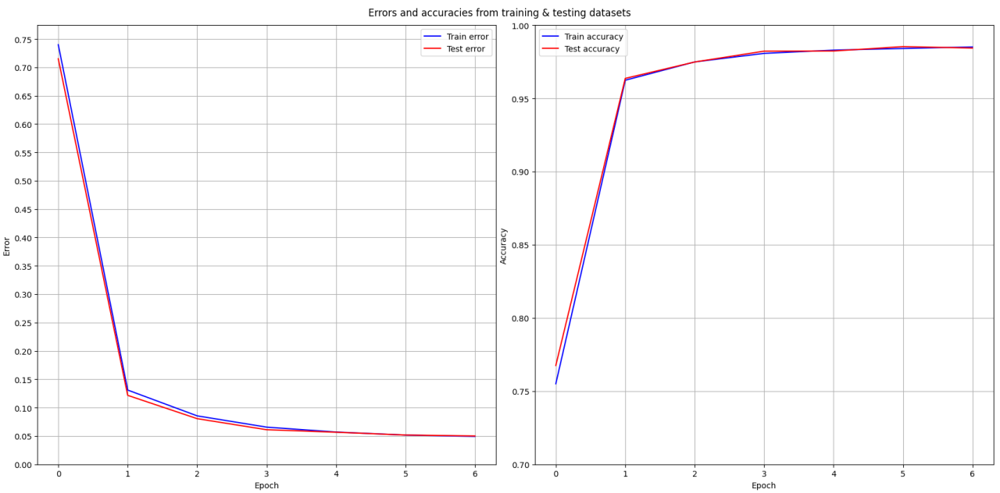

# digit-recognizer
Custom, from scratch implementation of the LeNet-5 CNN architecture found in Yann LeCun's paper from 1998, _Gradient-based learning applied to document recognition_.\
The network has been trained on the MNIST dataset, achieving an accuracy of 98.43 % on the testing data and was used in a graphical painting app to classify handwritten digits.

## Running the program
* Clone the repository
* Unzip `data/datasets.zip` to the `data/datasets` folder
* Install the following Python packages: `numpy`, `pandas`, `scipy`, `tqdm`, `matplotlib`
    * Either create a virtual environment in the `src` folder, activating it and installing packages with `pip install <package(s)>`
    * Or just install the packages system-wide with `pip install <package>`
* run `python gui.py` from the `src` folder\
(i.e. `cd` into the `src` folder first and then run `python gui.py`; running with `python src/gui.py` will yield an error\
because the paths to files like the datasets are written relative to the `src` folder, where all python scripts are)

## The network architecture

## Training method
* Used mini-batch Gradient Descent in order to train the model, with 7 epochs, a mini-batch size of 32 and a learning rate of 0.5.
* Additional optimizations include:
    * Original initialization method used in the paper: Fan-in initialization,\
    as opposed to initialization from the normal distribution using `np.random.randn()`\
    which made learning much slower.
    * Implemented step learning rate decay: given a step(int) and a decay rate(float),\
    the learning rate is multiplied by `decay_rate` every `step` epochs.

## Differences from the original LeNet-5 implementation in the paper
* Used _mini-batch Gradient Descent_ instead of _Stochastic Diagonal Levenberg-Marquardt method_
* Final layer is a _Softmax_ layer instead of the _RBF_ layer
* Used _Categorical Cross-Entropy loss_ function instead of the _Maximum Likelihood Estimation_ function

## Training results

    
Click to show output from training

    mini_batch_size = 32, learning_rate = 0.05
    Epoch 1
    100%|███████████████████████████████████████| 1875/1875 [29:04<00:00,  1.07it/s]
    Error in training dataset: 0.7399208668468596
    Error in testing dataset: 0.7151249063778997
    Accuracy in training dataset: 45301 / 60000
    Accuracy in testing dataset: 7675 / 10000

    Epoch 2
    100%|███████████████████████████████████████| 1875/1875 [30:03<00:00,  1.04it/s]
    Error in training dataset: 0.13091505710946405
    Error in testing dataset: 0.12159362125076978
    Accuracy in training dataset: 57740 / 60000
    Accuracy in testing dataset: 9636 / 10000

    Epoch 3
    100%|███████████████████████████████████████| 1875/1875 [30:08<00:00,  1.04it/s]
    Error in training dataset: 0.08543211707022709
    Error in testing dataset: 0.08048321825523162
    Accuracy in training dataset: 58490 / 60000
    Accuracy in testing dataset: 9748 / 10000

    Epoch 4
    100%|███████████████████████████████████████| 1875/1875 [29:51<00:00,  1.05it/s]
    Error in training dataset: 0.06554423194407401
    Error in testing dataset: 0.0609728026476118
    Accuracy in training dataset: 58841 / 60000
    Accuracy in testing dataset: 9822 / 10000

    Epoch 5
    100%|███████████████████████████████████████| 1875/1875 [30:32<00:00,  1.02it/s]
    Error in training dataset: 0.05690349068530533
    Error in testing dataset: 0.056546798855758106
    Accuracy in training dataset: 58973 / 60000
    Accuracy in testing dataset: 9823 / 10000

    Epoch 6
    100%|███████████████████████████████████████| 1875/1875 [30:31<00:00,  1.02it/s]
    Error in training dataset: 0.051576741322693444
    Error in testing dataset: 0.0516176290520085
    Accuracy in training dataset: 59043 / 60000
    Accuracy in testing dataset: 9853 / 10000

    Epoch 7
    100%|███████████████████████████████████████| 1875/1875 [30:18<00:00,  1.03it/s]
    Error in training dataset: 0.04920796506704963
    Error in testing dataset: 0.04999358291624394
    Accuracy in training dataset: 59103 / 60000
    Accuracy in testing dataset: 9843 / 10000

    Time elapsed: 15578.21276640892 s

    
Click to show the plotted errors and accuracies on both datasets, for all epochs

    

### Observations
* Usually after the first epoch of training on the MNIST dataset, models achieve an accuracy of over 90 %. In this case, it's only 76.75 %. \
However, in the following epochs, we can see the loss rapidly converging to an appropriate minimum, with no apparent sign of overtraining, \
such as the loss for the testing dataset being way higher than the one for the training set.

## Screenshots

    
Click to show screenshots of the GUI

    
    

## Limitations
* Due to the fact that the digits in the MNIST dataset images are always centered\
(the images are actually 20x20, padded with 4 pixels on each side),\
when the user draws a digit that is quite a bit off-center,\
the model will likely predict incorrectly or corretly but with very low confidence

    
Click to see screenshots of predictions of off-center drawn digits

    
    

## Ways to improve
* Train the model on the EMNIST dataset, that contains 280,000 images of handwritten digits, taken from a different, larger population
* Apply _data augmentation_ to the MNIST dataset:
    * Take a sample of images from the training dataset and apply to them the following modifications:
    * __Rotate__ by a few degrees
    * __Zoom__ in/out
    * __Shift or translate__ by a few pixels up/down/left/right

## Resources and inspirations
[Neural networks and deep learning book](http://neuralnetworksanddeeplearning.com/)
- This was what got me started developing this project;
- Even though the author wrote mostly about Fully Connected networks,\
the book still provided me with the basic understanding of neural networks.

[The Independent Code from youtube](https://www.youtube.com/@independentcode/)
- These videos provided a lot of value when it came to understanding the underlying math involved in Gradient Descent;
- The topics of Convolutional, Fully Connected and Softmax layers were very clearly explained.

[A tutorial online on how to build a CNN from scratch in Python](https://www.pycodemates.com/2023/07/build-a-cnn-from-scratch-using-python.html)
- Very simply layed out tutorial, with fairly reasonably explained code and underlying maths;
- Also touched the subject of Pooling (or subsampling) layers

[Yann LeCun et al., _Gradient-based learning applied to document recognition_](http://vision.stanford.edu/cs598_spring07/papers/Lecun98.pdf)
- There is a substantial amount of knowledge in the paper, which provided a solid foundation for modern CNN's